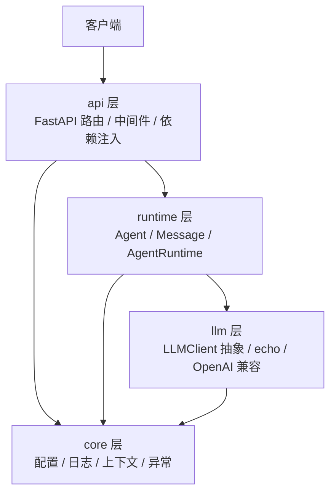

# AgentOS

一个企业级大模型 Agent 平台，目标能力：Tool Calling、Memory、Evaluation 与 Observability。

当前版本：**v0.1.0（工程基座）** —— 服务可启动、Runtime 可运行、抽象层与工程规范就位，业务能力持续迭代中。

## 能力矩阵

| 模块 | 能力 | 状态 |
| --- | --- | --- |
| HTTP 服务 | FastAPI 应用、统一错误响应、请求 ID、健康探针、OpenAPI 文档 | ✅ v0.1 |
| 认证 | API Key 中间件（默认关闭、失败关闭、常量时间比较） | ✅ v0.1 |
| Agent Runtime | Agent 定义、消息模型、运行循环、token 统计、运行结果 | ✅ v0.1 |
| LLM 抽象 | `LLMClient` 接口、echo 客户端、OpenAI 兼容客户端、注册表工厂 | ✅ v0.1 |
| 配置管理 | pydantic-settings，环境变量 / `.env` / 默认值三级覆盖 | ✅ v0.1 |
| 日志系统 | 结构化日志（console / json）、请求上下文、敏感字段脱敏 | ✅ v0.1 |
| Agent 管理 API | 注册、查询、列表、注销 | ✅ v0.1 |
| Tool Calling | 工具注册、参数校验、调用与结果回填 | ✅ v0.1 |
| 本地工具 | 目录浏览、文件读写、文本搜索、命令执行（沙箱 + 默认关闭命令） | ✅ v0.1 |
| Planning | 任务分解、步骤跟踪、进度注入系统提示词 | ✅ v0.1 |
| Memory | 短期会话记忆（内存）+ 长期记忆（SQLite 持久化、关键词检索） | ✅ v0.1 |
| Multi-Agent | 委托式协作（`delegate_to_agent`）、深度限制与子 Agent 隔离 | ✅ v0.1 |
| Evaluation / Observability | 评测集、指标与链路追踪 | 规划中 |
| Docker 部署 | 镜像与一键启动 | 规划中 |

## 架构



依赖方向固定为 `api → runtime → llm`，`core` 作为横切基础被各层复用，反向依赖被禁止。详见 [架构设计](docs/architecture.md)。

## 快速开始

环境要求：Python >= 3.11（推荐 3.12 / 3.13）。

```powershell
# 1. 创建虚拟环境并安装（含开发依赖）
py -3.13 -m venv .venv
.\.venv\Scripts\python.exe -m pip install -e ".[dev]"

# 2. 启动服务（默认 echo 客户端，不需要任何 API Key）
.\.venv\Scripts\python.exe -m agentos serve --port 8000
```

打开 <http://127.0.0.1:8000/docs> 查看交互式 API 文档。

```powershell
# 3. 调用一次 Agent 运行
curl.exe -X POST http://127.0.0.1:8000/api/v1/runs `
  -H "Content-Type: application/json" `
  -d '{"input": "你好，介绍一下你自己"}'
```

响应示例：

```json
{
  "run_id": "run_3f2a2a6c8526488c",
  "agent": "assistant",
  "output": "Echo: 你好，介绍一下你自己",
  "iterations": 1,
  "duration_ms": 0.161,
  "tool_call_count": 0,
  "finish_reason": "stop",
  "usage": {"prompt_tokens": 9, "completion_tokens": 3, "total_tokens": 12}
}
```

### 接入真实模型

默认的 `echo` 提供方只做回显，用于本地验证链路。接入任意 OpenAI 兼容服务：

```powershell
$env:AGENTOS_LLM__PROVIDER = "openai_compatible"
$env:AGENTOS_LLM__BASE_URL = "https://api.deepseek.com/v1"
$env:AGENTOS_LLM__API_KEY  = "sk-..."
$env:AGENTOS_LLM__MODEL    = "deepseek-chat"
.\.venv\Scripts\python.exe -m agentos serve
```

也可以复制 `.env.example` 为 `.env` 后填写。全部配置项见 [配置说明](docs/configuration.md)。

### 测试与静态检查

```powershell
.\.venv\Scripts\python.exe -m pytest        # 运行测试
.\.venv\Scripts\python.exe -m ruff check .  # 代码风格与静态检查
```

### Tool Calling（工具调用）

Agent 通过 `tools` 字段声明可用工具。工具由**服务端代码注册**（不接受通过 HTTP 注入可执行代码），
Runtime 会把工具声明透传给模型，并在模型请求调用时执行工具、把结果回填给模型。

内置工具：

| 工具 | 说明 | 默认 |
| --- | --- | --- |
| `get_current_time` | 按 UTC 偏移返回当前时间 | ✅ |
| `calculate` | AST 白名单算术求值（不使用 `eval`） | ✅ |
| `list_directory` | 列出工作区目录内容 | ✅ |
| `read_file` | 读取工作区文本文件 | ✅ |
| `search_text` | 在工作区内按正则搜索 | ✅ |
| `write_file` | 写入文本文件（覆盖需 `overwrite=true`） | ✅ |
| `run_command` | 执行 shell 命令 | ⚠️ **默认关闭** |
| `fetch_url` | 抓取公网网页并转纯文本（SSRF 防护） | ✅ |
| `web_search` | 联网搜索（需配置 API Key） | 需 Key |
| `remember` | 写入长期记忆 | ✅ |
| `recall` | 检索长期记忆 | ✅ |
| `create_plan` | 创建执行计划（任务分解） | ✅ |
| `update_plan_step` | 更新计划步骤状态 | ✅ |
| `delegate_to_agent` | 把子任务委托给其他 Agent | ✅ |

**安全模型**：文件工具的路径统一经过 `WorkspaceSandbox`，`..` 逃逸、外部绝对路径与
外部符号链接都会被拒绝；`.env`、私钥、API Key、`secrets/` 等敏感文件被列入黑名单。
`run_command` 执行的是真实 shell，**命令内部不受沙箱约束**，需显式设置
`AGENTOS_TOOLS__ALLOW_SHELL=true` 才会启用。

`fetch_url` 只允许访问**公网** http/https 地址：回环、内网与云元数据地址
（如 `169.254.169.254`）会被拒绝，重定向也会逐跳重新校验。
`web_search` 兼容 Tavily 接口，配置 `AGENTOS_TOOLS__WEB_SEARCH_API_KEY` 后自动启用。
详见 [配置说明](docs/configuration.md)。

```powershell
# 查看服务端已注册的工具
curl.exe http://127.0.0.1:8000/api/v1/tools

# 运行内置助手，由模型自行决定是否调用工具
curl.exe -X POST http://127.0.0.1:8000/api/v1/runs `
  -H "Content-Type: application/json" `
  -d '{"input": "calculate (12+8)*3"}'
```

响应里的 `tool_call_count` 表示本次运行实际执行的工具次数；`messages` 中能看到完整的
`assistant(tool_calls)` -> `tool(结果)` -> `assistant(最终回答)` 轨迹。

自定义工具只需继承 `Tool` 并注册进 `ToolRegistry`：

```python
from agentos.runtime.tools import Tool, ToolRegistry


class WeatherTool(Tool):
    """查询指定城市的当前天气。"""

    name = "get_weather"
    description = "查询指定城市的当前天气"
    parameters = {
        "type": "object",
        "properties": {"city": {"type": "string", "description": "城市名，例如 上海"}},
        "required": ["city"],
    }

    async def run(self, city: str) -> str:
        return f"{city}：晴，26℃"


registry = ToolRegistry([WeatherTool()])
```

工具执行失败（工具不存在、参数非法、内部异常）不会中断运行，而是把错误文本回填给模型，
让模型自行决定是否修正参数或向用户说明。

### 认证（API Key）

默认**关闭**，方便本地开发。对外暴露前务必开启：

```powershell
$env:AGENTOS_AUTH__ENABLED = "true"
$env:AGENTOS_AUTH__API_KEYS = '["sk-your-key"]'
.\\.venv\\Scripts\\python.exe -m agentos serve --port 8000
```

之后所有业务请求都要携带请求头（健康探针与 `/docs` 免认证）：

```powershell
curl.exe http://127.0.0.1:8000/api/v1/agents -H "X-API-Key: sk-your-key"
```

失败时返回统一的错误结构：

```json
{"error": {"code": "unauthorized", "message": "invalid or missing API key", "details": {"header": "X-API-Key"}}}
```

> 开启但没配置任何密钥时，服务会**拒绝所有请求**（fail closed）——
> 配置失误不应该变成安全漏洞。

### 多 Agent 协作

主 Agent 可以把子任务**委托**给其他已注册的 Agent，实现最小可用的消息路由：

```powershell
# 注册一个专家 Agent
curl.exe -X POST http://127.0.0.1:8000/api/v1/agents `
  -H "Content-Type: application/json" `
  -d '{"name": "researcher", "description": "负责资料调研", "system_prompt": "你是技术调研专家。"}'

# 主 Agent 会自动判断是否委托（工具描述里已列出可用 Agent）
curl.exe -X POST http://127.0.0.1:8000/api/v1/runs `
  -H "Content-Type: application/json" `
  -d '{"input": "调研一下 Agent 平台最核心的三个能力，有专门 Agent 就交给它做"}'
```

| 约束 | 说明 |
| --- | --- |
| 深度限制 | 委托链最多 3 层（`max_delegation_depth`），防止 A → B → A 无限递归 |
| 自我委托 | 直接拒绝，避免无意义递归 |
| 子 Agent 无状态 | 看不到父级对话，因此委托任务必须**自包含** |
| 可用 Agent | 通过 `GET /api/v1/agents` 查看，名字会动态写进工具描述 |

> 通过 API 新建的 Agent 默认**不带任何工具**，需要显式在 `tools` 字段里声明。

### 流式回复（SSE）

`POST /api/v1/runs/stream` 以 Server-Sent Events 逐段推送，适合聊天类前端。
事件类型：`start` / `delta` / `tool_call` / `tool_result` / `end` / `error`。

```powershell
curl.exe -N -X POST http://127.0.0.1:8000/api/v1/runs/stream `
  -H "Content-Type: application/json" `
  -d '{"input": "用三句话介绍 AgentOS"}'
```

```text
event: start
data: {"type": "start", "run_id": "run_...", "agent": "assistant", "session_id": "default"}

event: delta
data: {"type": "delta", "delta": "AgentOS "}

event: end
data: {"type": "end", "result": { ... 完整 RunResult ... }}
```

两个细节：文本增量**边收边发**，不做整段缓冲；模型调用工具时会先推 `tool_call` /
`tool_result` 事件再继续输出。响应带 `x-accel-buffering: no`，避免 Nginx 缓冲。

> 流式请求**不做重试** —— 一旦开始接收数据，重放会导致内容重复。

### 会话记忆（Memory）

会话记忆**默认开启**：不传 `session_id` 时落到默认会话 `default`，
服务端自动保存并复用最近对话；需要隔离多个会话时显式传 `session_id`。

```powershell
# 用默认会话：多轮自动记住（无需传 session_id）
curl.exe -X POST http://127.0.0.1:8000/api/v1/runs `
  -H "Content-Type: application/json" `
  -d '{"input": "我叫小明"}'
curl.exe -X POST http://127.0.0.1:8000/api/v1/runs `
  -H "Content-Type: application/json" `
  -d '{"input": "我叫什么名字"}'

# 用独立会话：显式传 session_id
curl.exe -X POST http://127.0.0.1:8000/api/v1/runs `
  -H "Content-Type: application/json" `
  -d '{"input": "我叫小明", "session_id": "chat-1"}'

# 第 2 轮：服务端自动带上第 1 轮历史
curl.exe -X POST http://127.0.0.1:8000/api/v1/runs `
  -H "Content-Type: application/json" `
  -d '{"input": "我叫什么名字", "session_id": "chat-1"}'
```

会话记忆当前是**进程内实现**，重启即清空；持久化与长期记忆（向量检索）属于后续阶段。

| 接口 | 说明 |
| --- | --- |
| `GET /api/v1/sessions` | 列出全部会话 |
| `GET /api/v1/sessions/{id}` | 查看会话消息 |
| `DELETE /api/v1/sessions/{id}` | 清除会话记忆 |

优先级：显式 `session_id` > 显式 `history`（调用方自行管理，无状态）> 默认会话。
把 `AGENTOS_MEMORY__DEFAULT_SESSION_ID` 设为空字符串即可恢复无状态。

#### 长期记忆

短期记忆随进程消失，长期记忆**落盘到 SQLite**，跨会话、跨重启保留：

```powershell
# 程序化写入
curl.exe -X POST http://127.0.0.1:8000/api/v1/memories `
  -H "Content-Type: application/json" `
  -d '{"content": "用户偏好用中文回答，喜欢简洁"}'

curl.exe http://127.0.0.1:8000/api/v1/memories
```

Agent 也可以自己维护：内置 `remember` / `recall` 两个工具，由模型判断
「什么值得长期记住」。此外每次运行前会**自动召回**相关记忆并注入系统提示词。

检索是**关键词匹配**（英文按词、中文按二元组加权），不依赖 embedding；
数据库默认在 `.agentos/memory.db`，已被 `.gitignore` 忽略。

容量由 `AGENTOS_MEMORY__MAX_MESSAGES_PER_SESSION`（默认 50）与
`AGENTOS_MEMORY__MAX_SESSIONS`（默认 1000，超出按 LRU 淘汰）控制。

## API 一览

| 方法 | 路径 | 说明 |
| --- | --- | --- |
| GET | `/health` | 存活探针，返回版本、环境与运行时长 |
| GET | `/health/ready` | 就绪探针，返回 LLM 提供方与已注册 Agent 数量 |
| GET | `/api/v1/agents` | 列出全部 Agent |
| POST | `/api/v1/agents` | 注册 Agent |
| GET | `/api/v1/agents/{name}` | 获取单个 Agent |
| DELETE | `/api/v1/agents/{name}` | 注销 Agent |
| POST | `/api/v1/runs` | 执行一次 Agent 运行 |
| POST | `/api/v1/runs/stream` | 流式执行（SSE，逐段推送） |
| GET | `/api/v1/tools` | 列出服务端已注册的工具 |
| GET | `/api/v1/memories` | 列出长期记忆 |
| POST | `/api/v1/memories` | 写入一条长期记忆 |
| DELETE | `/api/v1/memories/{id}` | 删除一条长期记忆 |
| GET | `/api/v1/sessions` | 列出全部会话记忆 |
| GET | `/api/v1/sessions/{id}` | 获取会话消息详情 |
| DELETE | `/api/v1/sessions/{id}` | 清除会话记忆 |
| GET | `/docs` | Swagger UI（`AGENTOS_API__ENABLE_DOCS=false` 可关闭） |

所有错误响应格式统一：

```json
{"error": {"code": "not_found", "message": "agent not found: ghost", "details": {"agent": "ghost"}}}
```

## 目录结构

```
src/agentos/
├── api/          # FastAPI 装配、中间件、依赖注入、路由与请求/响应模型
├── core/         # 配置、日志、请求上下文、异常体系
├── llm/          # LLM 客户端抽象、echo 与 OpenAI 兼容实现、工厂
└── runtime/      # Agent、Message、注册表与执行内核
tests/            # pytest 测试：配置 / 日志 / LLM / Runtime / API
docs/             # 架构、配置与开发文档
```

## 文档索引

- [架构设计](docs/architecture.md)
- [配置说明](docs/configuration.md)
- [开发指南](docs/development.md)
- [变更记录](CHANGELOG.md)
- [迭代计划](TODO.md)

## 开发约定

- 提交信息遵循 [Conventional Commits](https://www.conventionalcommits.org/)：`feat:` / `fix:` / `docs:` / `refactor:` / `test:`
- 新增能力必须附带测试，并保证现有测试不被破坏
- 每处改动都要有明确目的，避免顺手重构
- 变更同步记录到 `CHANGELOG.md`，待办同步到 `TODO.md`

## 许可证

[MIT](LICENSE)