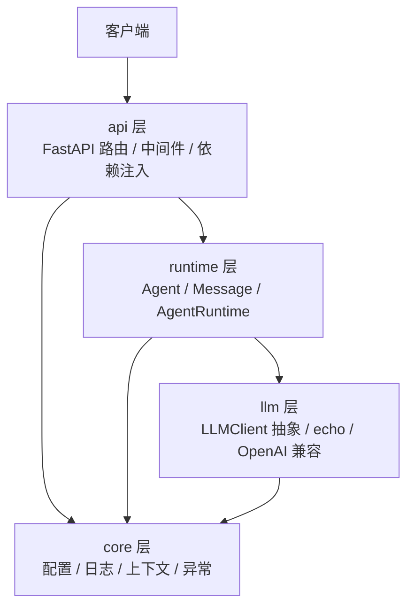

# AgentOS

一个企业级大模型 Agent 平台，目标能力：Tool Calling、Memory、Evaluation 与 Observability。

当前版本：**v0.1.0（工程基座）** —— 服务可启动、Runtime 可运行、抽象层与工程规范就位，业务能力持续迭代中。

## 能力矩阵

| 模块 | 能力 | 状态 |
| --- | --- | --- |
| HTTP 服务 | FastAPI 应用、统一错误响应、请求 ID、健康探针、OpenAPI 文档 | ✅ v0.1 |
| Agent Runtime | Agent 定义、消息模型、运行循环、token 统计、运行结果 | ✅ v0.1 |
| LLM 抽象 | `LLMClient` 接口、echo 客户端、OpenAI 兼容客户端、注册表工厂 | ✅ v0.1 |
| 配置管理 | pydantic-settings，环境变量 / `.env` / 默认值三级覆盖 | ✅ v0.1 |
| 日志系统 | 结构化日志（console / json）、请求上下文、敏感字段脱敏 | ✅ v0.1 |
| Agent 管理 API | 注册、查询、列表、注销 | ✅ v0.1 |
| Tool Calling | 工具注册、参数校验、调用与结果回填 | ✅ v0.1 |
| Memory | 会话记忆与长期记忆 | 规划中 |
| Multi-Agent | 多 Agent 协作与消息路由 | 规划中 |
| Evaluation / Observability | 评测集、指标与链路追踪 | 规划中 |
| Docker 部署 | 镜像与一键启动 | 规划中 |

## 架构



依赖方向固定为 `api → runtime → llm`，`core` 作为横切基础被各层复用，反向依赖被禁止。详见 [架构设计](docs/architecture.md)。

## 快速开始

环境要求：Python >= 3.11（推荐 3.12 / 3.13）。

```powershell
# 1. 创建虚拟环境并安装（含开发依赖）
py -3.13 -m venv .venv
.\.venv\Scripts\python.exe -m pip install -e ".[dev]"

# 2. 启动服务（默认 echo 客户端，不需要任何 API Key）
.\.venv\Scripts\python.exe -m agentos serve --port 8000
```

打开 <http://127.0.0.1:8000/docs> 查看交互式 API 文档。

```powershell
# 3. 调用一次 Agent 运行
curl.exe -X POST http://127.0.0.1:8000/api/v1/runs `
  -H "Content-Type: application/json" `
  -d '{"input": "你好，介绍一下你自己"}'
```

响应示例：

```json
{
  "run_id": "run_3f2a2a6c8526488c",
  "agent": "assistant",
  "output": "Echo: 你好，介绍一下你自己",
  "iterations": 1,
  "duration_ms": 0.161,
  "tool_call_count": 0,
  "finish_reason": "stop",
  "usage": {"prompt_tokens": 9, "completion_tokens": 3, "total_tokens": 12}
}
```

### 接入真实模型

默认的 `echo` 提供方只做回显，用于本地验证链路。接入任意 OpenAI 兼容服务：

```powershell
$env:AGENTOS_LLM__PROVIDER = "openai_compatible"
$env:AGENTOS_LLM__BASE_URL = "https://api.deepseek.com/v1"
$env:AGENTOS_LLM__API_KEY  = "sk-..."
$env:AGENTOS_LLM__MODEL    = "deepseek-chat"
.\.venv\Scripts\python.exe -m agentos serve
```

也可以复制 `.env.example` 为 `.env` 后填写。全部配置项见 [配置说明](docs/configuration.md)。

### 测试与静态检查

```powershell
.\.venv\Scripts\python.exe -m pytest        # 运行测试
.\.venv\Scripts\python.exe -m ruff check .  # 代码风格与静态检查
```

### Tool Calling（工具调用）

Agent 通过 `tools` 字段声明可用工具。工具由**服务端代码注册**（不接受通过 HTTP 注入可执行代码），
Runtime 会把工具声明透传给模型，并在模型请求调用时执行工具、把结果回填给模型。

内置两个示例工具：`get_current_time`（按 UTC 偏移返回时间）与 `calculate`（AST 白名单算术求值，无 `eval`）。

```powershell
# 查看服务端已注册的工具
curl.exe http://127.0.0.1:8000/api/v1/tools

# 运行内置助手，由模型自行决定是否调用工具
curl.exe -X POST http://127.0.0.1:8000/api/v1/runs `
  -H "Content-Type: application/json" `
  -d '{"input": "calculate (12+8)*3"}'
```

响应里的 `tool_call_count` 表示本次运行实际执行的工具次数；`messages` 中能看到完整的
`assistant(tool_calls)` -> `tool(结果)` -> `assistant(最终回答)` 轨迹。

自定义工具只需继承 `Tool` 并注册进 `ToolRegistry`：

```python
from agentos.runtime.tools import Tool, ToolRegistry


class WeatherTool(Tool):
    """查询指定城市的当前天气。"""

    name = "get_weather"
    description = "查询指定城市的当前天气"
    parameters = {
        "type": "object",
        "properties": {"city": {"type": "string", "description": "城市名，例如 上海"}},
        "required": ["city"],
    }

    async def run(self, city: str) -> str:
        return f"{city}：晴，26℃"


registry = ToolRegistry([WeatherTool()])
```

工具执行失败（工具不存在、参数非法、内部异常）不会中断运行，而是把错误文本回填给模型，
让模型自行决定是否修正参数或向用户说明。

## API 一览

| 方法 | 路径 | 说明 |
| --- | --- | --- |
| GET | `/health` | 存活探针，返回版本、环境与运行时长 |
| GET | `/health/ready` | 就绪探针，返回 LLM 提供方与已注册 Agent 数量 |
| GET | `/api/v1/agents` | 列出全部 Agent |
| POST | `/api/v1/agents` | 注册 Agent |
| GET | `/api/v1/agents/{name}` | 获取单个 Agent |
| DELETE | `/api/v1/agents/{name}` | 注销 Agent |
| POST | `/api/v1/runs` | 执行一次 Agent 运行 |
| GET | `/api/v1/tools` | 列出服务端已注册的工具 |
| GET | `/docs` | Swagger UI（`AGENTOS_API__ENABLE_DOCS=false` 可关闭） |

所有错误响应格式统一：

```json
{"error": {"code": "not_found", "message": "agent not found: ghost", "details": {"agent": "ghost"}}}
```

## 目录结构

```
src/agentos/
├── api/          # FastAPI 装配、中间件、依赖注入、路由与请求/响应模型
├── core/         # 配置、日志、请求上下文、异常体系
├── llm/          # LLM 客户端抽象、echo 与 OpenAI 兼容实现、工厂
└── runtime/      # Agent、Message、注册表与执行内核
tests/            # pytest 测试：配置 / 日志 / LLM / Runtime / API
docs/             # 架构、配置与开发文档
```

## 文档索引

- [架构设计](docs/architecture.md)
- [配置说明](docs/configuration.md)
- [开发指南](docs/development.md)
- [变更记录](CHANGELOG.md)
- [迭代计划](TODO.md)

## 开发约定

- 提交信息遵循 [Conventional Commits](https://www.conventionalcommits.org/)：`feat:` / `fix:` / `docs:` / `refactor:` / `test:`
- 新增能力必须附带测试，并保证现有测试不被破坏
- 每处改动都要有明确目的，避免顺手重构
- 变更同步记录到 `CHANGELOG.md`，待办同步到 `TODO.md`

## 许可证

[MIT](LICENSE)