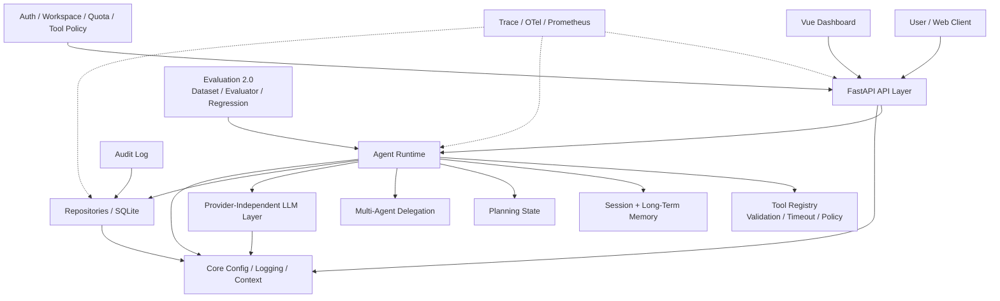
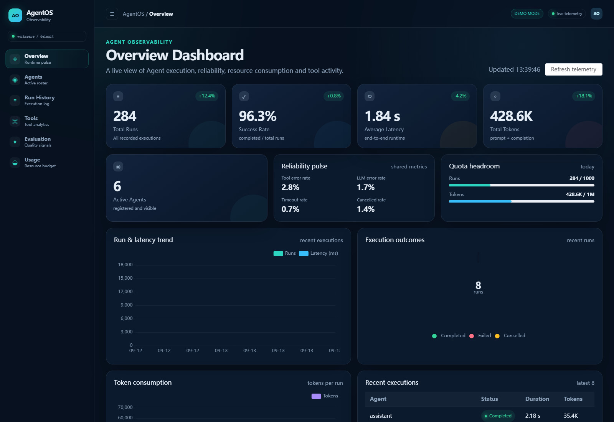

# AgentOS

**A production-oriented LLM Agent Platform for agent execution, tool orchestration, memory, evaluation, and runtime observability.**

AgentOS 是一个面向工程实践的大模型 Agent 平台，不只是对 LLM API 的简单封装。它将 Agent Runtime、Tool Calling、Memory、Planning、Multi-Agent、质量评估、可观测性和多租户平台能力组织为一套可运行、可测试、可部署的工程系统。

[](https://github.com/Tanglies/AgentOS/actions/workflows/ci.yml)
[](https://www.python.org/)
[](tests)
[](LICENSE)

## Overview

A conventional LLM application often looks like this:

```text
User request -> Prompt -> LLM -> Response
```

AgentOS treats the LLM as one component inside a larger execution system:

```text
User / Client
      |
      v
FastAPI API Layer
      |
      v
Agent Runtime
  |       |       |       |
  |       |       |       +--> Multi-Agent delegation
  |       |       +----------> Planning
  |       +------------------> Tool orchestration
  +--------------------------> Memory
      |
      v
LLM abstraction / Repository / Runtime state
      |
      v
Evaluation / Observability / Audit / Quota
      |
      v
Final response
```

The platform focuses on the parts that make Agent systems operable rather than just demonstrable:

- Agent execution lifecycle and bounded iteration
- Tool schemas, validation, timeout, concurrency, and policy checks
- Session and long-term memory with context budgets
- Planning state shared across Agent iterations
- Delegation with bounded depth
- Quality evaluation and regression comparison
- Trace context, audit records, OpenTelemetry, and Prometheus metrics
- Workspace isolation, API-key permissions, quota, and rate limiting

## Architecture



The dependency direction remains `api -> runtime -> llm`; `database` and `evaluation` provide supporting infrastructure, while `core` is the shared cross-cutting layer.

## Features

| Module | Capability |
| --- | --- |
| Agent Runtime | Agent lifecycle, iterative execution loop, streaming events, cancellation, bounded iterations and tool calls |
| LLM Layer | Provider-independent `LLMClient`, echo provider, OpenAI-compatible provider, retry and timeout handling |
| Tool System | JSON-schema based declarations, argument validation, execution timeout, parallel-safe execution, error feedback |
| Built-in Tools | Time, calculation, sandboxed filesystem, safe shell executor, web fetch/search, memory, planning, delegation |
| Tool Policy | Workspace and Agent scoped visibility, route permissions, and Runtime execution-time permission checks |
| Memory | LRU session memory plus SQLite-backed long-term memory with workspace/user scope and context budgets |
| Planning | Task decomposition, plan state, step updates, and system-prompt injection during each iteration |
| Multi-Agent | `delegate_to_agent` with depth limits and stateless child-Agent execution |
| Persistence | SQLite Repository layer for Agents, Runs, Memory, API keys, Audit, Evaluation, and migrations |
| Run History | Filtering, pagination, ordering, token usage, tool traces, and full message history |
| Evaluation | Runtime metrics plus JSONL datasets, rule evaluators, tool trajectory checks, optional LLM judge, and regression reports |
| Observability | Trace/request/run context, audit records, OpenTelemetry spans, and low-cardinality Prometheus metrics |
| Multi-Tenant | User, Workspace, membership, resource isolation, quota, usage, and sliding-window rate limit |
| API Security | Static bootstrap keys, hashed database API keys, permission scopes, and fail-closed authentication |
| Dashboard | Vue 3 / TypeScript observability UI for Overview, Agents, Runs, Trace, Tools, Evaluation, and Usage |
| Deployment | Multi-stage non-root Docker image, Compose, health checks, and GitHub Actions CI |

## Dashboard Preview

The repository includes a real Vue dashboard and checked-in screenshots. The default Demo Mode uses deterministic mock data, so the UI can be explored without a real LLM.



| View | Preview |
| --- | --- |
| Agents | [dashboard-agents.png](docs/assets/dashboard-agents.png) |
| Run History | [dashboard-runs.png](docs/assets/dashboard-runs.png) |
| Execution Trace | [dashboard-trace.png](docs/assets/dashboard-trace.png) |
| Tool Analytics | [dashboard-tools.png](docs/assets/dashboard-tools.png) |
| Evaluation | [dashboard-evaluation.png](docs/assets/dashboard-evaluation.png) |
| Usage | [dashboard-usage.png](docs/assets/dashboard-usage.png) |
## Quick Start

### Requirements

- Python 3.11 or newer
- Node.js 20.19 or newer for the optional Dashboard
- Docker Desktop only if you want to use Compose

### 1. Clone and install

```powershell
git clone https://github.com/Tanglies/AgentOS.git
cd AgentOS
python -m venv .venv

# Windows PowerShell
.\.venv\Scripts\python.exe -m pip install -e ".[dev]"

# macOS / Linux
# source .venv/bin/activate
# python -m pip install -e ".[dev]"
```

### 2. Configure the model provider

The default `echo` provider is deterministic and does not require an API key. To use an OpenAI-compatible provider:

```powershell
$env:AGENTOS_LLM__PROVIDER = "openai_compatible"
$env:AGENTOS_LLM__BASE_URL = "https://your-provider.example/v1"
$env:AGENTOS_LLM__API_KEY = "your-api-key"
$env:AGENTOS_LLM__MODEL = "your-model"
```

You can also copy `.env.example` to `.env` and edit it locally. `.env` is ignored by Git.

### 3. Start the backend

```powershell
.\.venv\Scripts\python.exe -m agentos serve --host 127.0.0.1 --port 8000
```

Verify readiness and make the first request:

```powershell
curl.exe http://127.0.0.1:8000/health/ready

curl.exe -X POST http://127.0.0.1:8000/api/v1/runs `
  -H "Content-Type: application/json" `
  -d '{"input":"Explain what AgentOS does in one sentence."}'
```

Open the API documentation at <http://127.0.0.1:8000/docs>.

### 4. Start the Dashboard

In a second terminal:

```powershell
cd frontend
Copy-Item .env.example .env.local
npm install
npm run dev -- --host 127.0.0.1
```

Open <http://127.0.0.1:5173>. The default `.env.example` enables `VITE_DEMO_MODE=true`; set it to `false` to use live backend data.

### 5. Docker Compose

```powershell
docker compose up --build
```

This starts the backend on port `8000` and the Dashboard on port `5173`.

### 6. Run the verification suite

```powershell
.\.venv\Scripts\python.exe -m pytest
.\.venv\Scripts\python.exe -m ruff check .

cd frontend
npm test
npm run build
```

## Core Design

### Agent Runtime

`AgentRuntime` is not a single `LLM.complete()` call. It owns the execution loop: assemble system/history/user messages, stream or complete an LLM call, execute requested tools, append tool results, and continue until the model stops or the iteration/tool budget is exhausted.

The runtime records `run_id`, iterations, duration, token usage, tool calls, errors, cancellation state, memory context usage, and estimated cost. `run()` is a convenience wrapper around the streaming execution path.

### Tool System

A tool is declared with a name, description, JSON-schema-like parameter contract, risk level, permission requirements, timeout, and `parallel_safe` flag. The execution path is:

```text
Tool schema
  -> model selects tool
  -> argument validation
  -> workspace/agent policy check
  -> route/tool permission check
  -> timeout-bounded execution
  -> ToolCallResult returned to Runtime
  -> result appended as a tool message
```

Only explicitly parallel-safe tools run concurrently; tools with side effects remain ordered. Errors and timeouts are returned to the model as structured tool results instead of crashing the whole Agent run.

### Memory

- **Session memory** is process-local, scoped by `session_id`, and uses LRU eviction plus turn-aligned truncation.
- **Long-term memory** is persisted in SQLite and can be scoped to a Workspace or user.
- Recall is keyword-based and bounded by recall count, character budget, and estimated token budget.
- A run records `memory_recall_count` and `memory_context_chars` for observability.

### Planning

Planning is a runtime-scoped `ExecutionPlan` stored in `contextvars`. The model can create or update a plan with `create_plan` and `update_plan_step`; the current plan is injected into the system prompt before every model iteration.

### Multi-Agent

`delegate_to_agent` exposes other registered Agents as a tool. Delegation is depth-limited, rejects self-delegation, and runs child Agents in a stateless context to avoid parent/child session leakage.

### Multi-Tenant Platform

AgentOS contains first-class User, Workspace, and membership models. Core resources are Workspace-scoped, including Agents, Runs, Memory, API keys, Audit records, Dashboard data, and Evaluation runs.

The platform also provides:

- Permission-scoped API keys with SHA-256 storage
- Workspace and Agent Tool Policy
- Quota and daily token/run budgets
- Sliding-window rate limiting
- Usage and reliability APIs

### Evaluation

HTTP success is not enough for an Agent platform. AgentOS separates engineering metrics from quality evaluation:

- Latency, token usage, success rate, tool count, and tool errors
- JSONL datasets and explicit evaluation cases
- Exact/contains/rule evaluators
- Tool trajectory validation against real `tool_calls`
- Optional LLM judge, disabled by default
- Baseline/candidate regression comparison
- Cost and reliability aggregation

### Observability

The runtime carries `request_id`, `trace_id`, `run_id`, `agent_name`, `tool_name`, actor, user, and Workspace context. The platform provides:

- Structured console or JSON logs
- Audit records for Agent and Tool lifecycle events
- OpenTelemetry spans for HTTP, Runtime, LLM, Tool, and Repository operations
- Optional OTLP export
- Prometheus metrics with low-cardinality labels
- Sensitive attribute filtering for prompts, keys, memory, and message content
## API Example

Authentication is disabled by default for local development. If `AGENTOS_AUTH__ENABLED=true`, add `X-API-Key` to the request headers.

Run an Agent:

```bash
curl -X POST http://127.0.0.1:8000/api/v1/runs \
  -H "Content-Type: application/json" \
  -d '{"input":"Calculate (12 + 8) * 3 and explain the result."}'
```

Query Run History:

```bash
curl "http://127.0.0.1:8000/api/v1/runs?agent=assistant&limit=10"
```

Read one execution trace:

```bash
curl "http://127.0.0.1:8000/api/v1/runs/run_xxxxxxxx"
```

Read Dashboard and reliability data:

```bash
curl "http://127.0.0.1:8000/api/v1/dashboard/overview"
curl "http://127.0.0.1:8000/api/v1/dashboard/reliability"
curl "http://127.0.0.1:8000/api/v1/dashboard/usage"
```

Start an Evaluation run:

```bash
curl -X POST http://127.0.0.1:8000/api/v1/evaluations/run \
  -H "Content-Type: application/json" \
  -d '{"dataset":"tool_calling.jsonl"}'
```

The complete route list is available in the Swagger UI at `/docs` and in [docs/evaluation-framework.md](docs/evaluation-framework.md), [docs/telemetry.md](docs/telemetry.md), and [docs/configuration.md](docs/configuration.md).

## Evaluation and Observability

Evaluation datasets live in `evals/`. The repository includes 20 runnable benchmark cases across Tool Calling, Memory, Planning, Multi-Agent, and Safety. Rule-based evaluators inspect real tool-call trajectories; the optional LLM judge is disabled unless explicitly configured.

Observability is available through:

```text
GET /metrics                    Prometheus endpoint when enabled
OTLP endpoint                    Optional OpenTelemetry export
GET /api/v1/dashboard/reliability  Timeout, tool, LLM, iteration, cancellation rates
GET /api/v1/audit                 Audit records with request/run context
```

Runtime spans include:

```text
http.request
  -> agent.run
      -> llm.call
      -> tool.call
      -> repository.query
```

## Testing

The repository currently collects more than 500 automated backend tests and includes frontend component, API, and Router tests.

```powershell
# Backend
.\.venv\Scripts\python.exe -m pytest
.\.venv\Scripts\python.exe -m ruff check .

# Frontend
cd frontend
npm test
npm run build
```

Coverage includes Runtime, Tool Calling, Tool Policy, Memory, Planning, Multi-Agent, Workspace isolation, API keys, Quota/Rate Limit, Audit, Evaluation, cancellation, timeout, cache, and observability.

## Roadmap

### Completed

- Agent Runtime, streaming, cancellation, and bounded execution
- Tool Calling with validation, permissions, timeout, and safe concurrency
- Session Memory, Long-Term Memory, and context budgets
- Planning and Multi-Agent delegation
- Agent persistence, Run History, Repository layer, and SQLite migrations
- Multi-Tenant Workspace isolation, API-key permissions, Quota, Rate Limit, and Audit
- Dashboard backend APIs and initial Vue Dashboard
- Evaluation 2.0 datasets, evaluators, reports, and regression comparison
- OpenTelemetry tracing and Prometheus metrics
- Docker/Compose and GitHub Actions CI
- Web cache, cost estimation, and reliability metrics

### Next

- End-user login with username/password and JWT or server-side sessions
- Semantic/vector Memory retrieval
- Independent Evaluation worker for long-running datasets
- More production deployment examples and external database options
- Demo GIF, repository Description, and GitHub Topics
- Grafana dashboard and collector deployment examples

## Design Philosophy

AgentOS is not intended to replace higher-level Agent frameworks. It exists to make the infrastructure side of Agent systems explicit and testable:

- How does an Agent run start, stop, stream, and cancel?
- How are tool schemas validated and authorized?
- How does memory affect prompt size and latency?
- How do plans and delegation survive multi-step execution?
- How can quality be evaluated beyond HTTP status codes?
- How can a Request be traced through Runtime, LLM, Tool, and Repository boundaries?
- How can multiple Workspaces share a process without sharing data?

Implementing those boundaries directly makes the tradeoffs visible, testable, and replaceable. The LLM provider itself remains behind a small interface so the platform is not coupled to one vendor.

## Project Structure

```text
src/agentos/
  api/             FastAPI routes, middleware, dependencies, and schemas
  core/            Configuration, logging, context, tenancy, and exceptions
  database/        SQLite connection, migrations, repository primitives
  evaluation/      Datasets, evaluators, runner, reports, and regression
  llm/             LLM contracts, echo client, OpenAI-compatible client
  observability/   Tracing, Prometheus metrics, cost estimation
  repositories/    Platform repository entry points
  runtime/         Agent Runtime, tools, memory, planning, services
frontend/          Vue 3 dashboard, API layer, demo mode, tests, nginx
evals/             JSONL benchmark datasets
tests/             Backend pytest suite
docs/              Architecture, configuration, deployment, and reliability docs
```

## Development

Useful documents:

- [Architecture](docs/architecture.md)
- [Configuration](docs/configuration.md)
- [Evaluation](docs/evaluation-framework.md)
- [Telemetry](docs/telemetry.md)
- [Deployment](docs/deployment.md)
- [Reliability](docs/reliability.md)
- [Development Guide](docs/development.md)

Before opening a pull request, run both backend and frontend verification commands shown in [Testing](#testing).

## License

MIT. See [LICENSE](LICENSE).